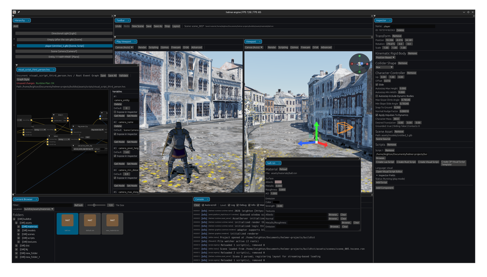

# [helmer](http://helmer.leighteg.dev) &nbsp; 

A performant, flexible, extensible, scalable foundation for creation; featuring a robust render graph and thoughtful architecture, allowing completely custom logic integrations. multiple logic integrations are provided.

Massively scalable runtime/collection of tooling masquerading as a game engine

💬 **[Stoat server](https://stt.gg/43zc35Aw)**

## Features
- multiplatform
- large scale hardware/driver support
- performant multithreading
- powerful ECS integrations [bevy_ecs, custom, etc..]
- "bring your own logic" approach providing callbacks to implement a custom logic paradigm
- rapier3D physics integration
- beautiful provided graph templates/passes
  - default/raster graph
    - SSGI
    - SSR
    - physically based sky [LUT based]
    - cascaded EVSM shadows [PCF]
    - etc..
  - hybrid graph
    - DDGIR
  - traced graph
    - monte-carlo path tracer
    - robust, scalable optimizations to accomidate real time performance
- right handed +Y-up coordinate system
- highly capable, scalable, robust render graph
- legacy monolithic renderers: deferred bindless renderer, forward per-material uniforms renderer, forward texture array renderer
- robust, low-overhead, massively scalable asset streaming to accomidate worlds of any scale/complexity
- frustum+occlusion culling
- LOD/cpu&gpu mip/meshlet/BLAS/TLAS generation
- non-blocking, highly threaded, deferred asset loading/processing/derivative generation
- anti-blocking, massively scalable architecture
- robust editor/build system, including powerful luau/rust/visual scripting integrations

---

- #### [`helmer`](/helmer) - the core runtime
- #### [`helmer_window`](/helmer_window) - `winit` windowing integration runtime extension
- #### [`helmer_input`](/helmer_input) - input handling/APIs runtime extension
- #### [`helmer_audio`](/helmer_input) - audio core/engine runtime extension
- #### [`helmer_render`](/helmer_render) - render graph runtime extension
- #### [`helmer_ui`](/helmer_ui) - ui runtime extension. robust retained APIs, rich `egui`-like immediate APIs
- #### [`helmer_editor_runtime`](/helmer_editor_runtime) - a robust runtime over `helmer_becs`, serving as the foundation for the editors/player
- #### [`helmer_editor_egui`](/helmer_editor_egui) - a featured, robust yet ergonomic editor over `helmer_becs`' egui integration, providing rich luau/rust/visual scripting integrations
- #### [`helmer_player`](/helmer_player) - runtime to be shipped alongside the resulting asset packs of editor projects

## Ways to use helmer

#### **Attention Windows users:** ensure the `C++ ATL for x64/x86 (Latest MSVC)` individual component is installed from Visual Studio Installer when depending on `helmer_render` (or disable `wgpu`'s `static-dxc` feature)

---

- ### `helmer_editor_egui`
  
  - `cargo run -p helmer_editor_egui --release`
  - see **[building](/building.md)** to build a project

|        integration       | desc                                                                                                                                   | ease  |
|:------------------------:|----------------------------------------------------------------------------------------------------------------------------------------|-------|
|     **`helmer_ecs`**     | the og! simple and surprisingly scalable (O(N) entity overhead!! 😭). basic scheduler                                                  | ****  |
|     **`helmer_becs`**    | a robust integration for the expeditious yet powerful [bevy_ecs](https://github.com/bevyengine/bevy/tree/main/crates/bevy_ecs) library | ***   |
| **`helmer_editor_egui`** | a featured, robust editor, exposing rich luau/rust/visual scripting integrations                                                       | ***** |
|  **custom integration**  | manually implement a app/game logic paradigm over `helmer`                                                                             | *     |

#### helmer_becs examples
- **[becs_bench](/becs_bench)**: same-ish scene as `test_game`, with entity spawner system used to stress test earlier on
- **[helmer_view](/helmer_view)**: a simple GLTF scene viewer tool, using `helmer_ui`'s immediate APIs

#### helmer_ecs examples
- **[test_game](/test_game)**: was the sandbox for spearheading features early on. bevy's ecs is better in every possible way and for that reason i have been using `helmer_becs` for everything since implementing it (i do wonder if there is any point in putting actual effort into a proper helmer ecs?)

## Troubleshooting
- **assets popping in/out, flickering**: the default vram budgets are incredibly low - combined with the aggressive nature of the default streaming tuning this results in the churning of render/vram resources. hit `ctrl+g` to bring up the `render graph` window and increase the gpu budgets, then hit `evict gpu only`. **helmer currently lacks the ability to agnostically probe avail/total vram**

## Left to do
- #### ~~taskable work pool [`helmer`]~~
- #### promote statelessness of GraphRenderer
- #### WASM audio (and likely more im forgetting)
- #### proper editor
  - `helmer_editor_egui`'s immediate nature is not scaling with the scope of the project 
  - `helmer_editor` served as a loose port of `helmer_editor_egui` as to ensure & spearhead features of `helmer_ui`'s retained APIs, meaning it inherited naughty/monolithic & immediate-motivated architectural decisions of `helmer_editor_egui`
- #### [50%] enforce proper, clean code structure (break up monoliths like AssetServer, audio, GraphRenderer, helmer_editor_egui/scripting, etc..)

## Why you did that
- `basis-universal-sys` was vendorized for WASM compatibility
- `egui-snarl` was vendorized because it handled rclick content menu input in a way that didnt allow elements like a search bar to be interacted with without the menu closing (closed on any click instead of clicks of proper intent)
- `egui-wgpu` vendorized for wgpu28 compatibility
